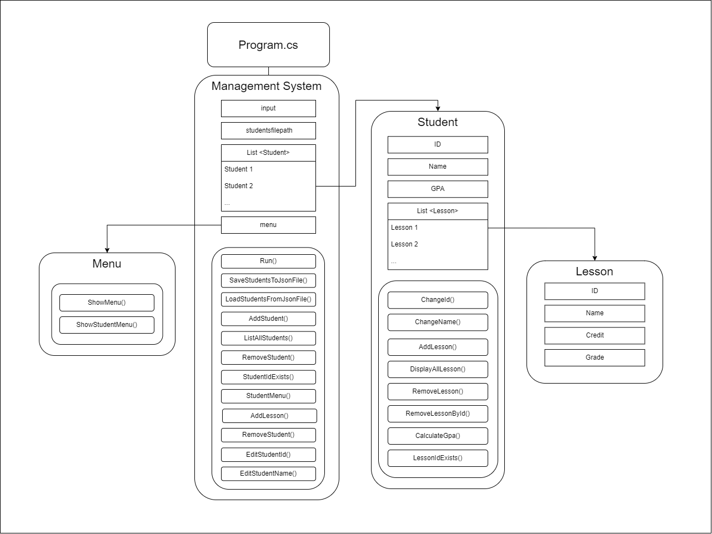

# Window Porgramming Project

# Diagram


# Classes

## Program
This function creates new instance of ManagementSystem class and the main function of the program.

## ManagementSystem
Variables

Functions
```c#
private void SaveStudentsToJsonFile(List<Student> students, string filePath)
```
This function takes `List<Student> students`,`string filePath` and saves the List as json file.
---
```c#
private List<Student> LoadStudentsFromJsonFile(string filePath)
```
This function takes `string filePath` and reads a json file and returns `List<Student> students`. If file is not found returns `new List<Student>`

